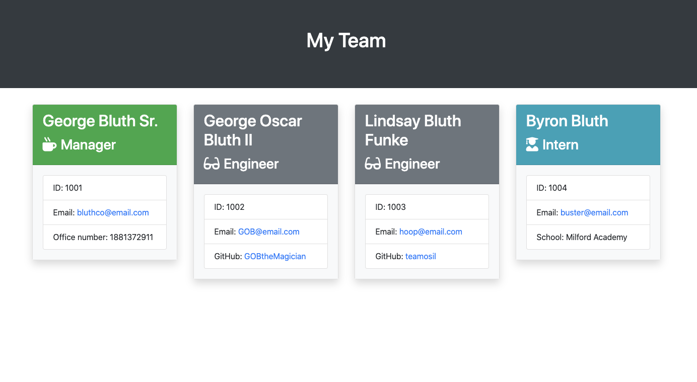
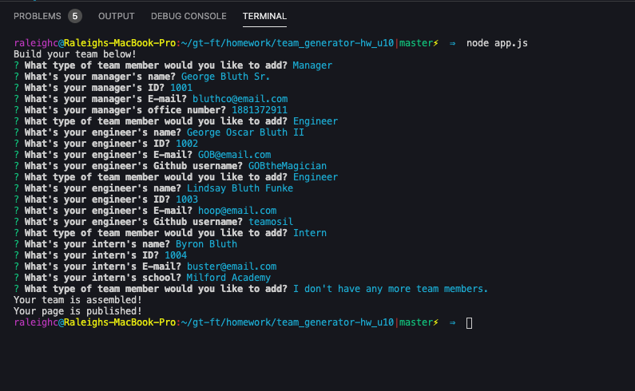

# Team Generator App

## Description

This application takes in user input on the command line to generate an html page of their teams key information.

## Usage

The user accesses this application through the command line. They use node to run the app.js file which will prompt them with a list of team member types to add to their roster. After selecting a member type, they will be prompted with a series of questions related to that position. 

Once they are finished assembling their team, they select that they do not have any more team members and their HTML file will be generated in the output folder ready to view in your browser.

[Watch Video of README Creator in action!](https://drive.google.com/file/d/1kJ_MtI1xasvBHKyChVhB2BhrlmJg61WD/view)

## Creating This Page

This application was created in node.js with javascript. The main challenges I faced with this project was overcoming testing. Unit testing feels like a backwards way of programming to me.  It draws a very narrow box to operate inside of and doesn't let you stray from that. This concept does make more sense to me after working on this project.  It gave me a clear direction that I needed to go in to solve the problems being presented. Working from the unit tests made the development clear and methodical. My next challenge was setting up the Inquirer prompts. This was done through trial and error to get to what I feel like is some of the cleanest code that I have written so far.

## Authors and Acknowledgment

This application was created by Raleigh Chesney under the guild lines of the GA Tech Coding Boot Camp.

NPMs:
* [Inquier](https://www.npmjs.com/package/inquirer)
* [FS](https://www.npmjs.com/package/fs)
* [Jest](https://jestjs.io/)

Web Dev Tools:
* [Mozille Developer Network](https://developer.mozilla.org/en-US/)
* [Stack Overflow](https://stackoverflow.com/)
* [w3schools!](https://www.w3schools.com/bootstrap4/default.asp)

## Languages Used
HTML5, JavaScript, Node.js

## Contributions

When contributing to this repository, please contact the owner of the repository before pushing any updates.
When contributions are accepted, please update the readme.md noting any changes that have been made.

## License

MIT License

Copyright (c) 2020 Raleigh Chesney

Permission is hereby granted, free of charge, to any person obtaining a copy
of this software and associated documentation files (the "Software"), to deal
in the Software without restriction, including without limitation the rights
to use, copy, modify, merge, publish, distribute, sublicense, and/or sell
copies of the Software, and to permit persons to whom the Software is
furnished to do so, subject to the following conditions:

The above copyright notice and this permission notice shall be included in all
copies or substantial portions of the Software.

THE SOFTWARE IS PROVIDED "AS IS", WITHOUT WARRANTY OF ANY KIND, EXPRESS OR
IMPLIED, INCLUDING BUT NOT LIMITED TO THE WARRANTIES OF MERCHANTABILITY,
FITNESS FOR A PARTICULAR PURPOSE AND NONINFRINGEMENT. IN NO EVENT SHALL THE
AUTHORS OR COPYRIGHT HOLDERS BE LIABLE FOR ANY CLAIM, DAMAGES OR OTHER
LIABILITY, WHETHER IN AN ACTION OF CONTRACT, TORT OR OTHERWISE, ARISING FROM,
OUT OF OR IN CONNECTION WITH THE SOFTWARE OR THE USE OR OTHER DEALINGS IN THE
SOFTWARE.

